## About
* A classifier that will segement the image into two parts - red and not red using Gaussian Discriminative Model
* A detector which detects if the red part has any STOP signs based on contour, and if a STOP sign is detected, it creates a bounding box around the STOP sign and return its co-ordinates in pixels

## File Details

### data_labelling.py: 
This script shows the image and asks the user to plot a region of interest. Multiple roi's can be given. It used the roipoly library. It generates an output numpy array of binary values 1 and 0, where 1 represents roi and 0 otherwise

### generate_data.py:
This script loads all the training images and their respective labels y=0 or 1 as numpy arrays and vectorizes them for faster computations, i.e. converts BGR (mxnx3) image to (m*nx3) 2D array where each row is a pixel and columns represent B,G and R channels respectively. It saves 2 npy files, X containing data of training images and Y containing data of image labels

### training_gaussian.py:
This script takes the numpy arrays X and Y generated by generate_data.py file as input. It uses MLE method to compute all the parameters required for the model, theta,mu and sigma for both the classes and stores them in a text file.

### stop_sign_detector:
This file has a class StopSignDetector(), with important memeber functions segement_iamge() and get_bounding_box()  

## Results

### Case 1:

  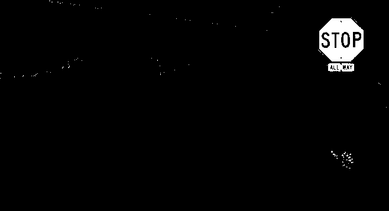
  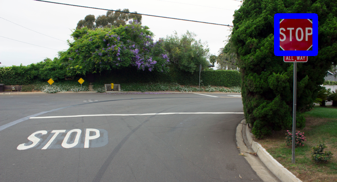 

### Case 2:

  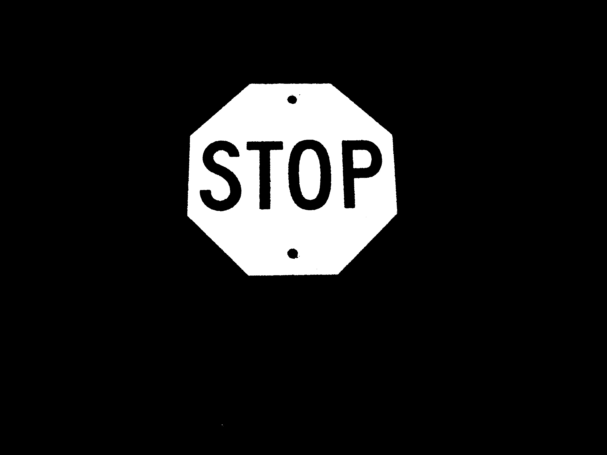
   

### Case 3:

  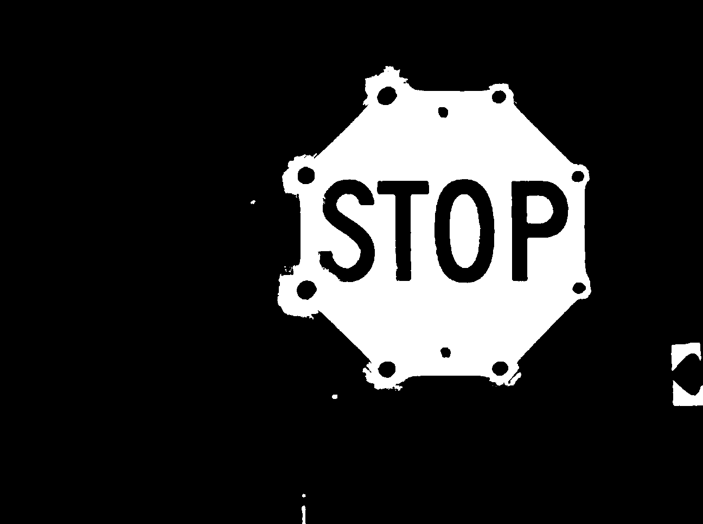
  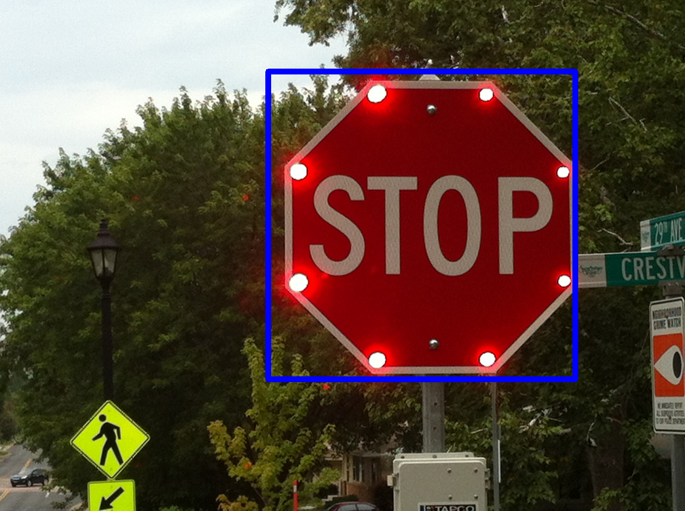 

### Case 4:

  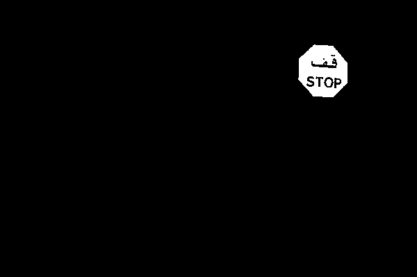
  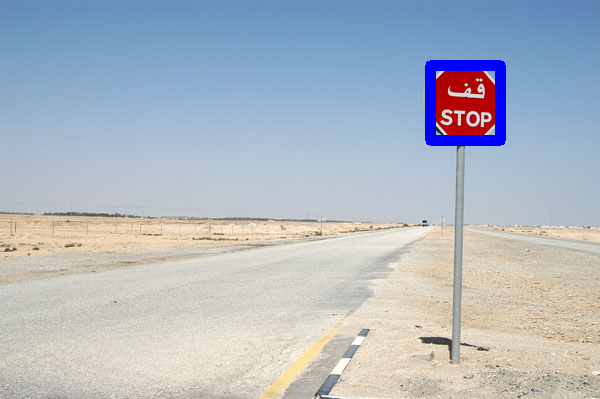 

### Case 5:

  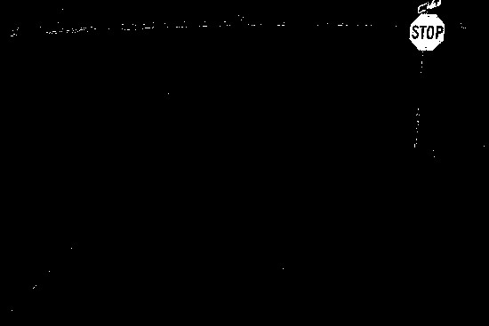
  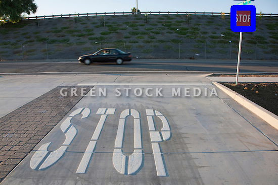 

### Case 6:

  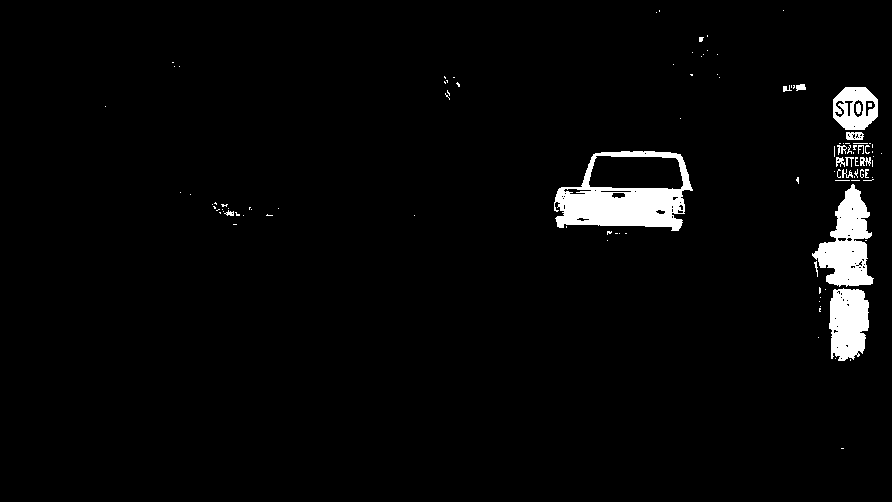
   

### Case 7:

  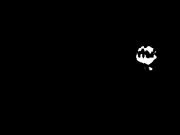
  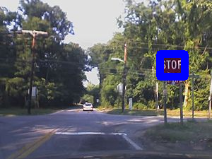 

### Case 8:

  
  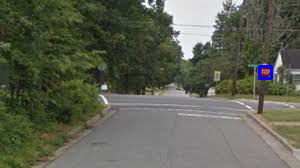 

### Case 9:

  
   

### Case 10:

  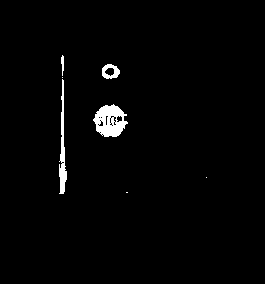
  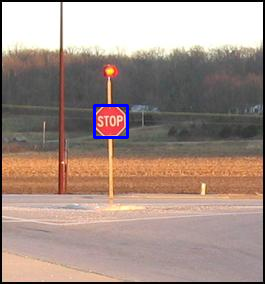 

### Case 11:

  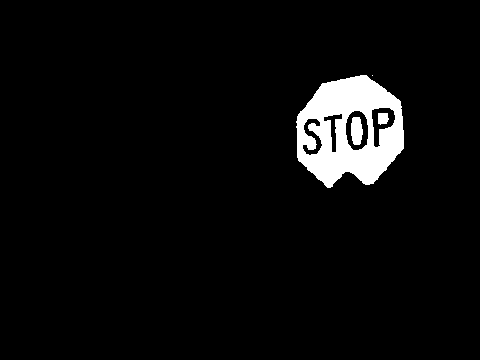
  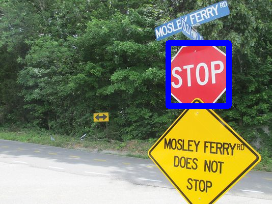 

### Case 12:

  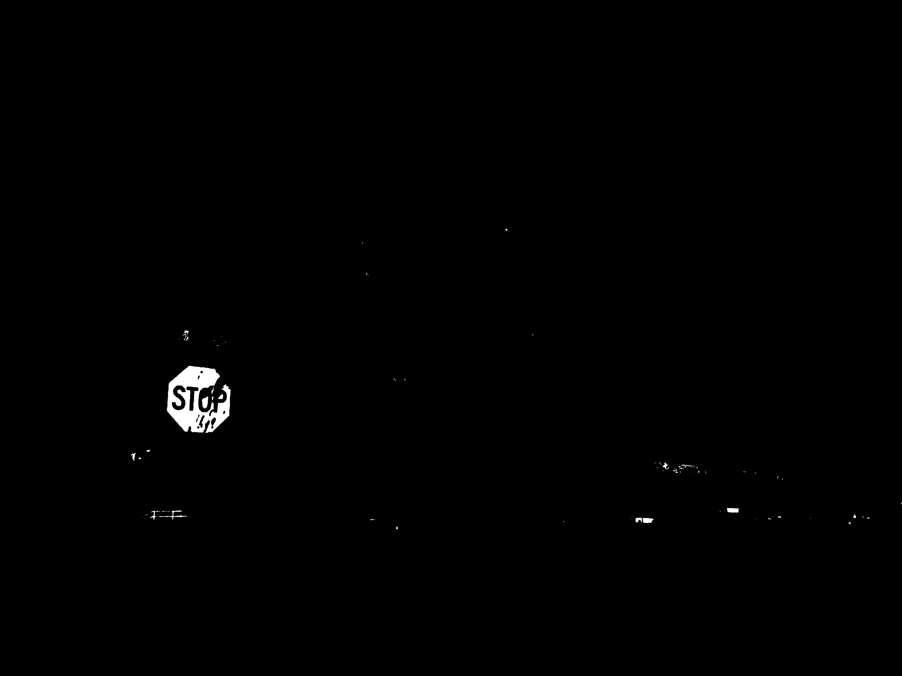
   

### Case 13:

  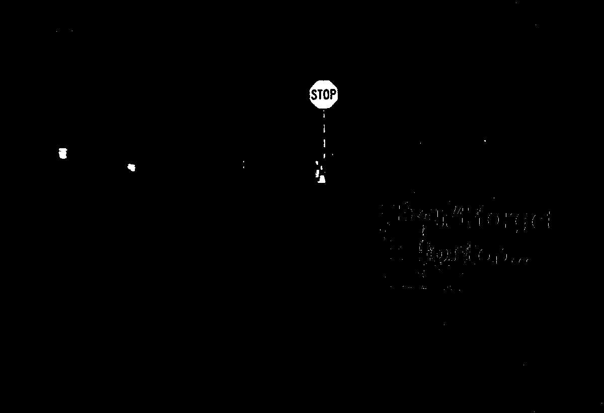
  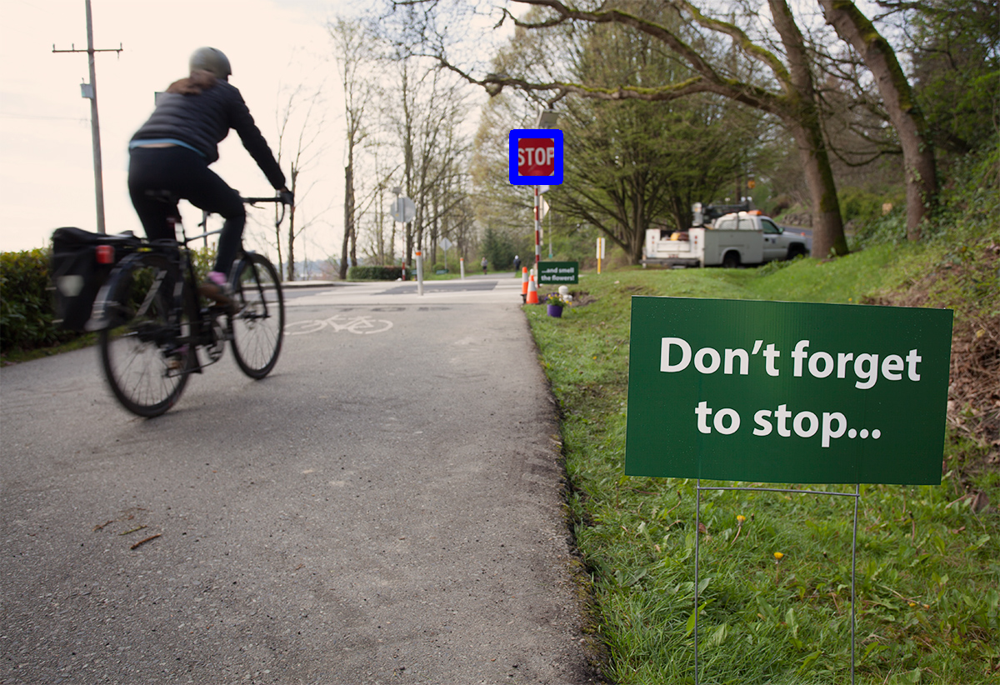 

